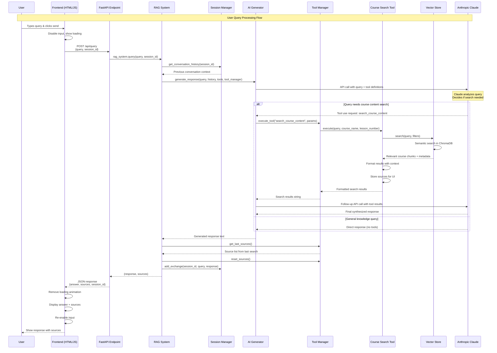

# RAG System Query Flow Diagram

## Component Breakdown

### Frontend Layer
- **HTML/CSS**: User interface with chat input and display
- **JavaScript**: Handles user interactions, API calls, and DOM updates
- **Features**: Loading states, session management, source display

### API Layer  
- **FastAPI**: RESTful endpoints with CORS middleware
- **Pydantic Models**: Request/response validation
- **Error Handling**: HTTP status codes and error messages

### RAG System Core
- **Orchestration**: Coordinates all components
- **Session Management**: Maintains conversation context
- **Tool Integration**: Manages available AI tools

### AI Processing
- **Anthropic Claude**: Large language model for response generation
- **Tool Calling**: Dynamic decision to search course content
- **Context Aware**: Uses conversation history for better responses

### Search & Retrieval
- **Vector Store**: ChromaDB with sentence-transformer embeddings
- **Smart Search**: Course name and lesson number filtering
- **Source Tracking**: Maintains attribution for responses

## Data Flow Summary

1. **Input**: User query → Frontend validation
2. **Transport**: HTTP POST → API endpoint  
3. **Context**: Session history → AI context
4. **Intelligence**: Claude analysis → Tool decision
5. **Retrieval**: Semantic search → Relevant content
6. **Synthesis**: AI generation → Coherent response
7. **Attribution**: Source tracking → UI display
8. **Output**: Formatted response → User interface

## Key Features

- **Adaptive Search**: AI decides when course content search is needed
- **Context Preservation**: Session-based conversation memory
- **Source Attribution**: Tracks and displays content sources
- **Error Resilience**: Graceful handling at each stage
- **Performance**: Efficient vector search and caching